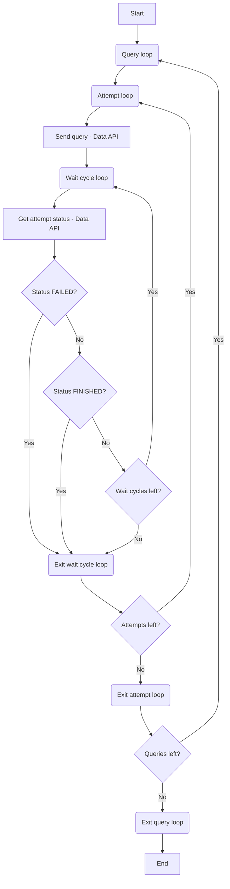
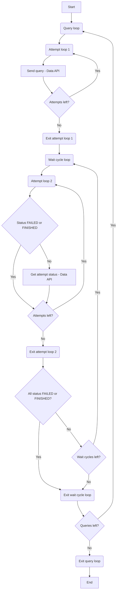

## Automate repeated testing of queries with Amazon Redshift Data API

### Overview
Use this project to automate repeated testing of queries on both Amazon Redshift provisioned and serverless environments. At the end of each tested query, min, max, and average duration will be calculated.

### config.yml
Stores connection details as well as settings for your runs. Create it in the root directory of this project. You can store multiple configurations.

| Parameter                  | Mandatory | Type    | Default | Valid Value              | Description                                              |
| -------------------------- | --------- | ------- | ------- | ------------------------ | -------------------------------------------------------- |
| clusterid_or_workgroupname | Yes       | string  |         | Any string               | Provisioned (clusterid) or serverless (workgroupname)    |
| type                       | Yes       | string  |         | provisioned / serverless | Provisioned or serverless                                |
| dbname                     | Yes       | string  |         | Any string               | Database name                                            |
| secret_arn                 | Yes       | string  |         | Any string               | Secret ARN storing credentials                           |
| attempts                   | No        | integer | 1       | value > 0, value <= 200  | Number of times to run query                             |
| wait_cycles*               | No        | integer | 5       | value > 0                | Number of times to poll for status                       |
| sleep_time*                | No        | integer | 5       | value > 0                | Seconds to wait between polls                            |
| synchronous                | No        | boolean | True    | True / False             | Wait for attempt to finish before moving to next attempt (True) or run all attempts without waiting for previous attempt to finish (False) |
| silent                     | No        | boolean | True    | True / False             | Log less (True) or more (False) information             |
| resultcache                | No        | boolean | False   | True / False             | Enable (True) or disable (False) result cache            |
| mvrewrite                  | No        | boolean | False   | True / False             | Enable (True) or disable (False) query rewrite to use MV |

*For synchronous=True, if wait_cycles=40 and sleep_time=5, each attempt of a query times out at 200 seconds. If more time is needed, increase wait_cycles or sleep_time or both.

*For synchronous=False, if wait_cycles=40 and sleep_time=5, all attempts of a query times out at 200 seconds. If more time is needed, increase wait_cycles or sleep_time or both.

```yaml
config_1:
  clusterid_or_workgroupname: [CLUSTER_ID]
  type: provisioned
  dbname: [DATABASE_NAME]
  secret_arn: [SECRET_ARN]
  attempts: 30
  wait_cycles: 40
  sleep_time: 5
  synchronous: True
  silent: True
  resultcache: False
  mvrewrite: False
config_2:
  clusterid_or_workgroupname: [WORKGROUPNAME]
  type: serverless
  dbname: [DATABASE_NAME]
  secret_arn: [SECRET_ARN]
```

### Configure test_queries
Create yaml files containing the list of queries you need to repeatedly test in test_queries directory. sample_queries.yml is for reference and can be tested. Multi-line queries are supported. Queries that depends on the completion of prior queries are also supported.

sample_queries.yml
```yaml
# query with return
- >
  select current_user;
# query with error
- >
  select current_user1;
# query with no return
- >
  create temp table tmp_a as select 'abc' as col_1;
# query with dependency and return
-
  - >
    create temp table tmp_a as
    select 'abc' as col_1;
  - >
    create temp table tmp_b as
    select upper(col_1) from tmp_a;
  - >
    select * from tmp_b;
# unformatted query
- "
        select 
* from 
     (select 'unformatted query' 
  as col_1)
"
```

### Start auto testing
Run command `python3 auto_test.py [target based on config.yml] [name of file in test_queries]`.

* Output shown on console will be saved in logs directory as TIMESTAMP.log
* Run details from data api will be saved in run_details directory as TIMESTAMP.csv

Synchronous console output which is also saved in logs directory
```shell
$ python3 auto_test.py config_2 sample_queries.yml
...
2022-10-24 16:31:53,722:__main__:INFO:653:	Test 1
2022-10-24 16:31:53,722:__main__:INFO:328:	- set enable_result_cache_for_session to off;
2022-10-24 16:31:53,722:__main__:INFO:328:	- set mv_enable_aqmv_for_session to off;
2022-10-24 16:31:53,722:__main__:INFO:328:	- select current_user;
2022-10-24 16:31:53,810:__main__:INFO:404:	Attempts
2022-10-24 16:31:59,345:__main__:INFO:445:	- 1, FINISHED, 0.0996 s, Has result
2022-10-24 16:32:04,676:__main__:INFO:445:	- 2, FINISHED, 0.0224 s, Has result
2022-10-24 16:32:10,016:__main__:INFO:445:	- 3, FINISHED, 0.0590 s, Has result
2022-10-24 16:32:15,342:__main__:INFO:445:	- 4, FINISHED, 0.1094 s, Has result
2022-10-24 16:32:20,668:__main__:INFO:445:	- 5, FINISHED, 0.0200 s, Has result
2022-10-24 16:32:20,668:__main__:INFO:589:	Total duration stats (FINISHED)
2022-10-24 16:32:20,670:__main__:INFO:591:	- Min: 0.020 s
2022-10-24 16:32:20,670:__main__:INFO:594:	- Max: 0.109 s
2022-10-24 16:32:20,671:__main__:INFO:597:	- Avg: 0.062 s
2022-10-24 16:32:20,671:__main__:INFO:589:	Last query duration stats (FINISHED)
2022-10-24 16:32:20,671:__main__:INFO:591:	- Min: 0.008 s
2022-10-24 16:32:20,672:__main__:INFO:594:	- Max: 0.011 s
2022-10-24 16:32:20,672:__main__:INFO:597:	- Avg: 0.009 s
2022-10-24 16:32:20,672:__main__:INFO:612:	Sample records
2022-10-24 16:32:20,751:__main__:INFO:629:	
  current_user
0      awsuser
...
```

Asynchronous output which is also saved in logs directory
```shell
$ python3 auto_test.py config_2 sample_queries.yml
...
2022-10-24 16:02:13,988:__main__:INFO:656:	Test 1
2022-10-24 16:02:13,988:__main__:INFO:328:	- set enable_result_cache_for_session to off;
2022-10-24 16:02:13,988:__main__:INFO:328:	- set mv_enable_aqmv_for_session to off;
2022-10-24 16:02:13,988:__main__:INFO:328:	- select current_user;
2022-10-24 16:02:14,044:__main__:INFO:478:	Attempts
2022-10-24 16:02:14,436:__main__:INFO:498:	- 1, SUBMITTED
2022-10-24 16:02:14,667:__main__:INFO:498:	- 2, SUBMITTED
2022-10-24 16:02:14,889:__main__:INFO:498:	- 3, SUBMITTED
2022-10-24 16:02:15,134:__main__:INFO:498:	- 4, SUBMITTED
2022-10-24 16:02:15,363:__main__:INFO:498:	- 5, SUBMITTED
2022-10-24 16:02:15,819:__main__:INFO:532:	- PICKED: 1, STARTED: 3, FINISHED: 1
2022-10-24 16:02:21,112:__main__:INFO:532:	- FINISHED: 5
2022-10-24 16:02:21,112:__main__:INFO:560:	- 1, FINISHED, 0.1809 s, Has result
2022-10-24 16:02:21,112:__main__:INFO:560:	- 2, FINISHED, 0.1580 s, Has result
2022-10-24 16:02:21,112:__main__:INFO:560:	- 3, FINISHED, 0.1495 s, Has result
2022-10-24 16:02:21,112:__main__:INFO:560:	- 4, FINISHED, 0.1664 s, Has result
2022-10-24 16:02:21,112:__main__:INFO:560:	- 5, FINISHED, 0.2354 s, Has result
2022-10-24 16:02:21,113:__main__:INFO:589:	Total duration stats (FINISHED)
2022-10-24 16:02:21,113:__main__:INFO:591:	- Min: 0.150 s
2022-10-24 16:02:21,113:__main__:INFO:594:	- Max: 0.235 s
2022-10-24 16:02:21,113:__main__:INFO:597:	- Avg: 0.178 s
2022-10-24 16:02:21,113:__main__:INFO:589:	Last query duration stats (FINISHED)
2022-10-24 16:02:21,114:__main__:INFO:591:	- Min: 0.007 s
2022-10-24 16:02:21,114:__main__:INFO:594:	- Max: 0.045 s
2022-10-24 16:02:21,114:__main__:INFO:597:	- Avg: 0.019 s
2022-10-24 16:02:21,114:__main__:INFO:612:	Sample records
2022-10-24 16:02:21,176:__main__:INFO:629:	
  current_user
0      awsuser
...
```

Run details from data api saved in run_details directory
```
Test,Attempt,CreatedAt,Duration,HasResultSet,Id,QueryString,RedshiftQueryId,ResultRows,ResultSize,Status,UpdatedAt,Error
1,1,2022-10-22 11:06:44.173000+08:00,0.009239951,False,cb464aae-bfd1-4c54-85c1-5035cbb2bc2c:1,set enable_result_cache_for_session to off;,-1,0,0,FINISHED,2022-10-22 11:06:44.562000+08:00,
1,1,2022-10-22 11:06:44.173000+08:00,0.009156079,False,cb464aae-bfd1-4c54-85c1-5035cbb2bc2c:2,set mv_enable_aqmv_for_session to off;,-1,0,0,FINISHED,2022-10-22 11:06:44.599000+08:00,
1,1,2022-10-22 11:06:44.173000+08:00,0.012202275,True,cb464aae-bfd1-4c54-85c1-5035cbb2bc2c:3,select current_user; ,-1,1,7,FINISHED,2022-10-22 11:06:44.694000+08:00,
1,2,2022-10-22 11:06:49.785000+08:00,0.004933082,False,966f650c-ff3d-4c04-bdf8-06ef23165d14:1,set enable_result_cache_for_session to off;,-1,0,0,FINISHED,2022-10-22 11:06:50.361000+08:00,
1,2,2022-10-22 11:06:49.785000+08:00,0.004842397,False,966f650c-ff3d-4c04-bdf8-06ef23165d14:2,set mv_enable_aqmv_for_session to off;,-1,0,0,FINISHED,2022-10-22 11:06:50.438000+08:00,
1,2,2022-10-22 11:06:49.785000+08:00,0.009893159,True,966f650c-ff3d-4c04-bdf8-06ef23165d14:3,select current_user; ,-1,1,7,FINISHED,2022-10-22 11:06:50.529000+08:00,
...
```

### Synchronous flow


### Asynchronous flow


## Security

See [CONTRIBUTING](CONTRIBUTING.md#security-issue-notifications) for more information.

## License

This library is licensed under the MIT-0 License. See the LICENSE file.

